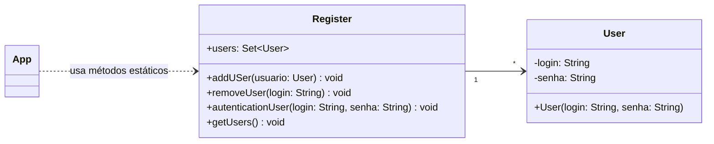
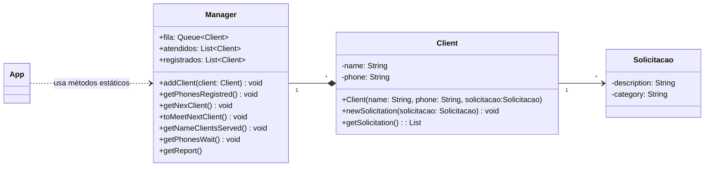
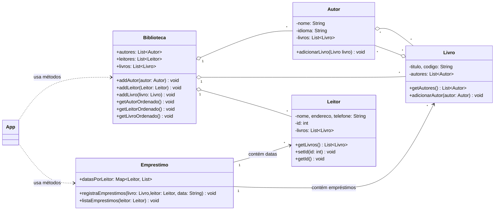

# Engenharia de Telecomunicações - Programação Orientada a Objetos
## Bernardo Souza Muniz - Lista de exercícios 3

### Como usar o repositório
Para clonar o repositório para a sua máquina local utilizando Git, basta executar o seguinte comando no seu terminal:

`git clone https://github.com/sergio-prolo-class/lista-3-BernardoMuniz39`

### Sobre
Este repositório tem o objetivo de apresentar a resolução da lista 3 da disciplina de Programação orientada a objetos. Durante a realização do projeto, foi utilizada as estruturas de dados presentes biblioteca da **API Collections**.

Para utilizar o projeto, certifique-se de estar dentro da pasta do exercício que deseja visualizar e com o gradle instalado no seu computador. Digite o seguinte comando no terminal da sua máquina local:

`gradle run` ou `./gradlew run`

Fique a vontade para usar os métodos de cada objeto conforme sua curiosidade!

## Login
O exercício simula uma aplicação web que conta com uma classe utilitária estática responsável por gerenciar os usuários registrados no sistema.

Requisitos funcionais da classe:
- Cadastra novos usuários a partir de login e senha, garantindo que logins não se repitam.
- Remove usuários com base em seu login.
- Lista os logins de todos os usuários cadastrados, preservando a ordem de cadastro.
- Autentica usuários, verificando se login e senha correspondem a um usuário existente.

#### Diagrama UML:

## Atendimento
O exercício simula uma fila de atendimento que organiza os clientes conforme a ordem de chegada de novas solicitações.

Requisitos funcionais:
- Registra novas solicitações de atendimento, vinculadas ao nome e telefone do cliente.
- Lista os telefones de todos os clientes já registrados.
- Imprimi o nome do próximo cliente da fila.
- Atende o próximo cliente da fila.
- Listar os nomes dos clientes já atendidos.
- Listar os telefones dos clientes ainda em espera.
- Gerar relatório estatístico contendo o total de solicitações registradas, atendidas e em espera e a distribuição percentual das solicitações por categoria.

#### Diagrama UML:

## Biblioteca
O exercício simula o funcionamento básico de um sistema de biblioteca, fazendo registros de novos leitores, autores, livros e realizando empréstimos.

Requisitos funcionais:
- Cadastra autores, livros e leitores
- Registrar empréstimos de livros para leitores
- Lista todos os autores em ordem alfabética
- Lista os leitores por ordem alfabética e por ID
- Lista os livros ordenados por título, autor e código ISBN
- Realiza empréstimos de livro para um leitor
- Lista as datas de todos os emprestimos de um leitor

#### Diagrama UML:
