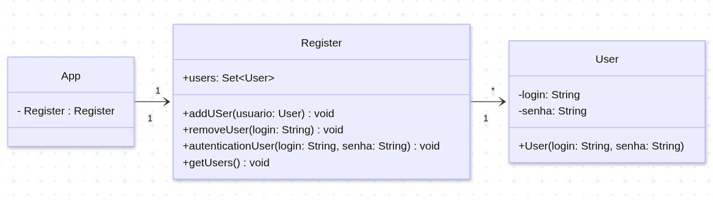
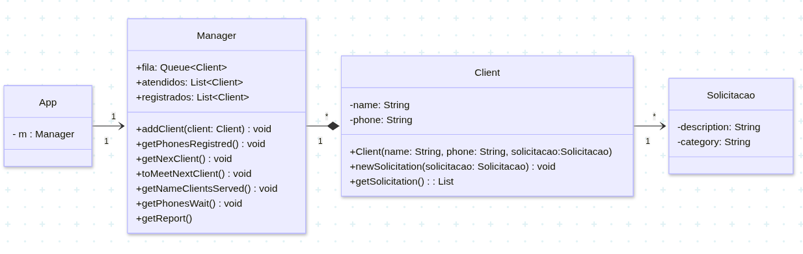

# Engenharia de Telecomunicações - Programação Orientada a Objetos
## Bernardo Souza Muniz - Lista de exercícios 3

### Como usar o repositório
Para clonar o repositório para a sua máquina local utilizando Git, basta executar o seguinte comando no seu terminal:

`git clone https://github.com/sergio-prolo-class/lista-3-BernardoMuniz39`

### Sobre
Este repositório tem o objetivo de apresentar a resolução da lista 3 da disciplina de Programação orientada a objetos. Durante a realização do projeto, foi utilizada as estruturas de dados presentes biblioteca da **API Collections**.

Para utilizar o projeto, certifique-se de estar dentro da pasta do exercício que deseja visualizar e com o gradle instalado no seu computador. Digite o seguinte comando no terminal da sua máquina local:

`gradle run` ou `./gradlew run`

Fique a vontade para usar os métodos de cada objeto conforme sua curiosidade!

## Login

  

## Atendimento

  

        
